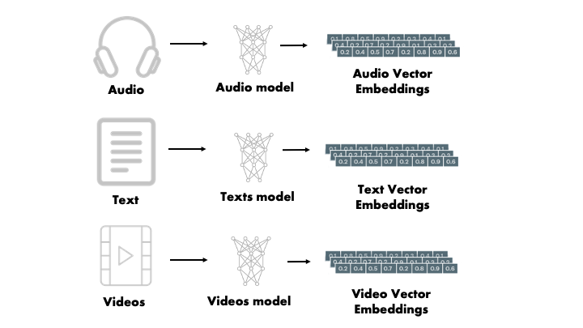

# image-search
> Harness the power of Weaviate's vector search capabilities for image embeddings. This application seamlessly integrates image processing, conversion, and vector-based search

The core of this application lies in harnessing the power of vector embeddings to represent images in a way that makes similarity search efficient and accurate. Here's a deeper dive into the processes:

## Image Embedding with ResNet50:

Whenever an image is uploaded, it's passed through the ResNet50 model, a deep convolutional neural network pre-trained on more than a million images from the ImageNet database. ResNet50 is well-regarded in the deep learning community for its ability to extract essential features from images, enabling it to achieve remarkable accuracy in image classification tasks.



The result of this process is a vector embedding of the image, which essentially transforms the image's pixels into a compact vector representation in a high-dimensional space. The position and direction of these vectors carry meaningful semantic information about the image.


## Storing in a Vector Database:

Once the vector embedding for an image is obtained, it is stored in the vector database.

Unlike traditional databases that might store data based on IDs or categories,   uses the vector embeddings to position data in a high-dimensional space. The proximity of vectors in this space directly relates to the similarity of the data they represent.
Vector-Based Similarity Search:

When querying for similar images, the input image is similarly converted into a vector embedding using ResNet50.
This vector is then used to search within vector space. The search algorithm looks for vectors that are closest to the input vector, based on cosine similarity or other distance metrics. The idea is simple: the closer the vectors, the more similar the images they represent.
As a result, images that have similar content, even if they are not pixel-wise identical, can be identified and retrieved with high accuracy.
This process, powered by deep learning and vector search technology, offers a revolutionary way to handle image similarity tasks, providing results that are semantically meaningful and contextually relevant.

# Features
+ Image Embedding: Use state-of-the-art algorithms to transform your images into meaningful vector representations.
+ Similarity Search: Embed and then retrieve the most similar images from your dataset with astonishing accuracy.
+ Docker Integration: Get started without hassles! Docker Compose packages all the necessary components ensuring a smooth deployment.

# 📋 Table of Contents
- [Installation](#🔧-installation)
- [Quick Start](#🚀-quick-start)
- [Usage](#📘-usage)
- [Stack](#stack)
- [Documentation](#documentation)
- [Dataset Credit](#📚-dataset-credit)
- [Contributing](#🤝-contributing)
- [License](#📜-license)

## 🔧 Installation
Before starting, make sure you have Docker and Docker Compose installed. If they aren't, follow the official Docker and Docker Compose guides.

### *Clone the repository:*

```
git clone https://github.com/TochKa21U/image-search

cd image-search
```
### *Build and launch the Docker containers:*

```
docker-compose up --build -d
```

Your Weaviate Image Embedding Application is now set up and ready!

## 🚀 Quick Start
Access the Gradio interface on your browser at http://localhost:7860.

***Before searching for similar images, ensure you've uploaded images into the database. Without any images, Gradio won't be able to fetch any results.***

Use the **/upload** endpoint to upload an image. Ensure your image is in PNG, JPEG, or JPG format. Also, provide a description string that describes the uploaded item.

Once you've populated the database, you're all set to find similar images!

For more API endpoints and detailed documentation, __visit /docs after setting up the containers.__

## 📘 Usage
+ Populate the Database: It's crucial to add images before querying for similarity. Use the /upload endpoint to grow your dataset.
+ Query for Similarity: With a populated database, upload diverse images via Gradio to understand the magic of vector-based similarity search.
+ Optimization: While default configurations are in place, adjust the algorithms and configurations as required for your unique dataset.

## Stack

+ API will be served on FastAPI by default on 8888 port

+ Weaviate Vector DB will be used for storing vector embeddings

+ PyTorch based model will be responsible for Vector Embeddings(Resnet50)

+ All this application will be also wrapped in Gradio as well for frontend display


## Documentation

> Please visit */docs* the see Swagger documentation

## 📚 Dataset Credit
A big shoutout to the [Fashion Product Images(Small)](https://www.kaggle.com/datasets/paramaggarwal/fashion-product-images-small). from Kaggle used for verification and testing. If you're searching for a diverse dataset to try out, give it a go!

## 🤝 Contributing
Contributions, suggestions, and feedback are always welcome! Please check out our contribution guidelines for more details.

## 📜 License
This project operates under no Licence.